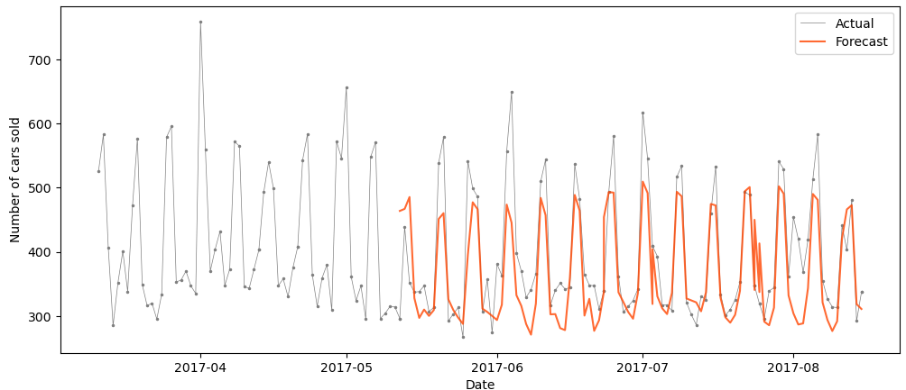

# Time Series Forecast for Store Sales with XGBoost

*Tools: Python, Pandas, Matplotlib, A/B testing, XGBoost, SARIMA, Data Analysis*

In this project, I use store sales data of an Ecuadorian Shop Group to predict the future number of sales. Additional metadata is available for the oil price and holidays, as well as, as big earthquake event in 2015. 

I first performed an explorative data analysis and introduced several lag features. Then I used A/B testing to figure out if holidays and/or the earthquake affected the sales.

Finally, I used SARIMA and XGBoost to predict the number of sales. XGBoost performed slightly better and reproduced the seasonalities with good accuracy. The average uncertainty on the predictions is around 15%. For more details on all aspects of the projects please have a look at the Python notebook.

